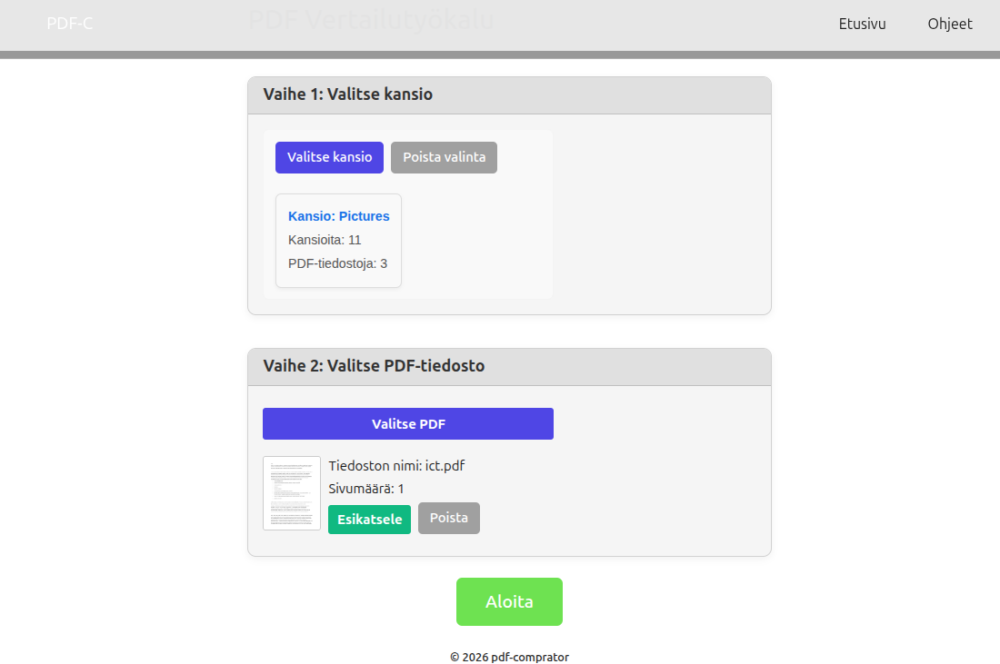

# PDF Comparator

Yksinkertainen PDF-tiedostojen vertailun raakile.

Projektia ei tällä hetkellä kehitetä aktiivisesti.

Client on React.

## Toiminta

1. Valitaan kansio.
2. Sovellus laskee kansion PDF-tiedostot (max. 1000).
3. PDF pudotetaan vertailtavaksi.
4. Sovellus etsii kansiosta samankaltaisia PDF-tiedostoja.

> Konenäköä ei käytetä.

## LISENSSI

[LICENSE](./LICENSE)

CC0 1.0 Universal — free to use, modify, copy, and distribute, including for commercial purposes.

This project is released under the CC0 1.0 Universal public domain dedication.

CC0 1.0 Universal — Official License